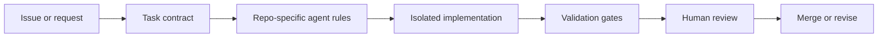

# Agentic Workflow

## Issue to implementation

## Task contract

Every agent task should start with:

- goal,
- files or areas likely in scope,
- out-of-scope changes,
- success criteria,
- validation commands,
- review expectations.

## Validation gates

Validation gates should be specific commands, not vague requests. Examples:

- `python3 -m unittest`
- `npm test`
- `npm run lint`
- `pytest tests/specific_test.py`
- manual UI checklist with exact route and expected behavior

## Human review loop

Human review is required before merge when changes affect:

- public APIs,
- data migrations,
- billing or auth,
- user-visible product behavior,
- research outputs,
- confidentiality boundaries.
